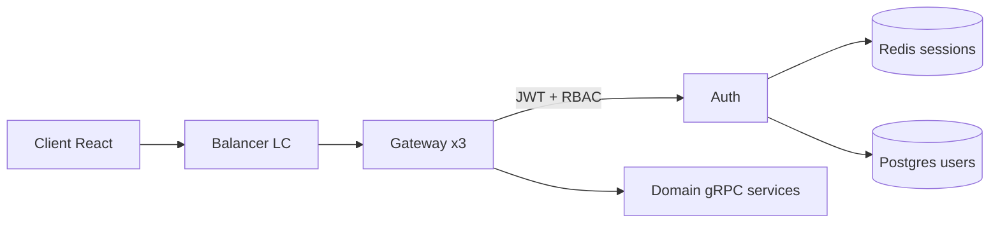
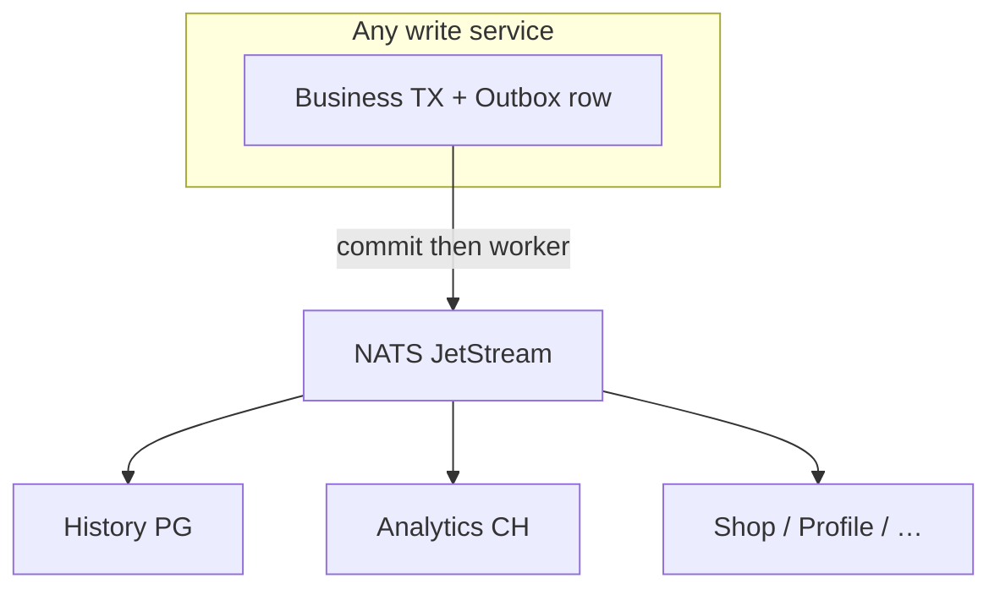

# How does Event Horizon work?

> Living explanation of the system for engineers and **system design interviews**.  
> Sources: Miro `event-horizon-v1.0.6.png`, **[`event-horizon-v1.0.7-system-design.md`](./event-horizon-v1.0.7-system-design.md)** (Mermaid), `confluence/architecture/*`, compose + real `services/*` (Aug 2026).  
> Older docs (`SYSTEM_DESIGN.md`) still say `:5051` etc. — **canonical gRPC ports are `5005x`** below.

---

## 1. One-sentence pitch

Event Horizon is a **Go microservices game/content platform**: React client → custom L7 balancer → 3× API Gateway → domain gRPC services, with **NATS JetStream** for async events, **per-service Postgres** (+ Redis cache), **Mongo** (inventory experiment), **ClickHouse** (analytics), and an **MCP/RAG** side-path for AI tooling.

---

## 2. What the Miro diagram (v1.0.6) shows

Read the board left → right as **request path**, center as **event spine**, bottom as **ops**.

### Edge
- **Client** (React) hits **Load Balancer** → **API Gateway** cluster.
- **Auth** sits next to the gateway (JWT + Redis session/refresh + Postgres users + outbox).
- **MCP Server (RAG)** is drawn as a peer of the gateway: tools/docs for agents, not on the hot game path.
- **ADS / WebSocket** style diamond: real-time push (leaderboard / notifications flavor) beside the classic HTTP path.

### Domain services (boxes 1–10 on the board)
Typical cell: **Service → Redis → Postgres → Outbox → NATS**.

| # | Service | Sync API | Store notes |
|---|---------|----------|-------------|
| 1 | Game | gRPC | Postgres scores; no Redis in current code |
| 2 | Billing | gRPC | Postgres balances + outbox; Redis cache |
| 3 | Leaderboard | gRPC | Postgres + Redis sorted sets; NATS in |
| 4 | Profile | gRPC | Postgres + Redis |
| 5 | Shop | gRPC | Postgres + Redis; calls Billing + Payment |
| 6 | Notification | events | Kafka/NATS consumers (push path) |
| 7 | Analytics | gRPC | **ClickHouse** (OLAP), NATS ingest |
| 8 | History | gRPC | Postgres trail, retention ~30d, NATS ingest |
| 9 | Payment | gRPC | Postgres + Redis; Boosty-style checkout |
| 10 | Inventory | gRPC | Postgres + **Mongo** + Redis decorator |

**Authors** (profiles for creators) exists in code/compose even if the Miro board folds it into inventory/author flows — treat as service `:50061`.

### Spine
**NATS JetStream Hub** in the middle: all outboxes publish here; History/Analytics/Shop/Profile/… subscribe with durable consumers.

### Observability (green block)
Prometheus `:9090`, Grafana `:3000`, Jaeger `:16686`, NATS explorer/exporter `:7777`.

### Metrics callouts on the board (product/ops story)
- DAU ~10k, MAU ~100k; RPS avg ~35–50, peak ~100 (not 100k).
- Storage classes: PG ~1TB class, Redis tens of GB, Mongo hundreds GB, CH 1–5TB class (capacity story, not current laptop compose).
- Delivery: Ansible + GHA; deploy compose + k3s; Selectel multi-node cost sketch.

---

## 3. Request path (synchronous)

```text
Browser (React :5173)
    │  HTTP/JSON
    ▼
Balancer :8079          ← Least Connections
    │  HTTP
    ▼
Gateway ×3 :8081–8083   ← JWT (RequireAuth), RBAC (RequireRole),
    │                       rate limit, circuit breaker, HTTP→gRPC
    ▼
Domain gRPC (50051…)    ← Clean Arch: handler → service → repository
    │
    ├── Postgres (own DB)
    ├── Redis (cache / session) where wired
    └── (Inventory also Mongo)
```

Gateway responsibilities (interview bullet):

1. Terminate HTTP; validate JWT via Auth (`ValidateToken` + Redis session).
2. Enforce roles (`user` | `author` | `admin`).
3. Route `/api/<domain>/…` → gRPC client; forward `x-user-role` on mutating inventory calls.
4. Fail-fast **503** when circuit is open (billing/shop/payment).
5. Serve OpenAPI `/openapi.yaml` + `/docs`.

Services **do not** call each other randomly over gRPC for every domain hop — money paths are explicit (Shop→Billing, Shop→Payment). Cross-cutting fan-out is **NATS**.

---

## 4. Event path (asynchronous)

```text
Service TX:
  UPDATE business_table
  INSERT outbox(event)
  COMMIT
        │
        ▼
Outbox worker ──publish──► NATS JetStream subject
                                │
                ┌───────────────┼────────────────┐
                ▼               ▼                ▼
            History         Analytics        Shop / Profile / …
           (Postgres)      (ClickHouse)      (durable consumer)
```

Important subjects (see also Prydwen NATS doc):

| Subject | From | To (examples) |
|---------|------|----------------|
| `score.updated` | Game path | Leaderboard, Profile, History, Analytics |
| `user.registered` | Auth path | Profile, History, Analytics |
| `inventory.item.created` | Inventory outbox | Shop (creates merch listing) |
| `shop.purchased` | Shop | History, Analytics, fulfillment/Kafka path |
| `payment.completed` | Payment outbox | History, Analytics |
| `author.upserted` | Authors outbox | History, Analytics |
| `balance.updated` | Billing outbox | interested consumers |

**Why Outbox?** Exactly-once *intent*: DB commit and “message will be published” share one transaction; worker drains after commit. Prevents “balance changed but event lost” / “event sent but TX rolled back”.

Kafka (`purchase.paid`) is the Week-5 fulfillment track — complements NATS, does not replace it.

---

## 5. Storage rationale (why four engines)

| Engine | Role in EH | Interview phrase |
|--------|------------|------------------|
| **PostgreSQL** | Source of truth per service (auth, money, shop, history) | “Database per service + ACID + outbox” |
| **Redis** | Sessions, cache-aside, leaderboard hot path | “Ephemeral / cache; never sole ledger” |
| **MongoDB** | Inventory flexible attributes (experimental; keep) | “Document model for polymorphic items” |
| **ClickHouse** | Analytics DAU/MAU/retention | “OLAP column store; not on checkout path” |

Anti-pattern we avoid: putting MAU SQL on History Postgres.

---

## 6. Canonical ports (code + compose, Aug 2026)

| Service | gRPC | Metrics | Notes |
|---------|------|---------|-------|
| Auth | 50051 | 9091 | PG 5460, Redis sessions |
| Game | 50052 | 9092 | PG 5461 |
| Billing | 50053 | 9093 | PG 5462, Redis |
| Leaderboard | 50054 | 9094 | PG 5463, Redis |
| Shop | 50055 | 9095 | PG 5465, Redis; needs Payment |
| Notification | 50056 | 9102 | |
| Analytics | 50057 | 9106 | ClickHouse 8123/9000 |
| Payment | 50058 | 9103 | PG 5467, Redis |
| Inventory | 50059 | 9096 | PG 5466, Redis, Mongo 27017 |
| Profile | 50060 | 9099 | PG 5464, Redis |
| Authors | 50061 | 9104 | PG 5468, Redis |
| History | 50062 | 9105 | PG 5469, retention 30d |
| Gateway | HTTP 8081–8083 | 9095–9097 | |
| Balancer | HTTP 8079 | 9098 | |
| NATS | 4222 (+ cluster) | exporter 7777 | JetStream |

Host port collisions (e.g. Shop metrics 9095 vs Gateway-1 metrics 9095) are **different containers**; only host publish maps matter — see `PORTS_IDEA.md`.

---

## 7. Security & money path (short)

1. Login → access + refresh; refresh in Redis; access validated on each protected call.
2. Author stocks inventory via Gateway `RequireRole(author|admin)` + inventory gRPC role metadata.
3. Shop purchase: tickets via Billing; if `category=merch` → Payment `CanPurchaseMerch` (subscription).
4. Payment is Boosty-redirect style checkout + webhook confirm → `payment.completed`.
5. Optimistic `version` on balances / inventory stock / shop items; circuit breaker at gateway.

Status code policy: `STATUS_CODES.md` in this history folder + Prydwen `02_STATUS_CODES.md`.

---

## 8. How folders in `confluence/architecture/` fit

| File | Use |
|------|-----|
| `SYSTEM_DESIGN.md` | Early narrative (ports partially stale) |
| `EH_SCHEMAS.md` | Miro drawing script / interview sketch steps |
| `PORTS_IDEA.md` | Host port discipline |
| `SHOP_DESIGN.md` / `ANALYTICS_DESIGN.md` / `NOTIFICATION_DESIGN.md` | Domain intent sketches |
| `MCP_WHEN.md` | When MCP becomes valuable (after API freeze) |
| `MONOREPO_IDEA.md` | Repo layout thinking |
| `SYSTEM_DESIGN/event-horizon-v1.0.6.png` | Visual overview (this doc explains it) |
| **This file** | Current “how it works” + interview schemas |

---

## 9. Interview-ready schemas (prefer these over raw Miro)

Miro v1.0.6 is great as a **poster**; in a 45-minute interview draw **3 layered diagrams** (whiteboard / Excalidraw / Mermaid). Keep each under ~8 boxes.

### Schema A — Edge & sync (first 5 minutes)



Talk track: least-connections, JWT at edge, no shared DB, HTTP→gRPC façade.

### Schema B — Event spine + Outbox (the money shot)



Talk track: dual-write problem, outbox, durable consumers, at-least-once + idempotency.

### Schema C — Polyglot persistence (why not one DB)

```mermaid
flowchart TB
  Billing & Auth & Shop --> PG[(PostgreSQL)]
  Sessions & LB hot --> RD[(Redis)]
  Inventory attrs --> MG[(MongoDB)]
  DAU MAU Retention --> CH[(ClickHouse)]
```

Talk track: OLTP vs cache vs document vs OLAP; never run analytics on checkout DB.

### Schema D — Purchase saga (optional deep dive)

```text
Purchase(item):
  if merch → Payment.CanPurchaseMerch
  Billing.Spend(tickets)
  Shop.PurchaseItemWithStock (FOR UPDATE + version)
  on failure → refund AddCurrency + shop.purchase.failed
  on success → NATS shop.purchased (+ Kafka purchase.paid)
```

Talk track: local compensation vs full orchestrator; circuit on Billing/Payment.

### Schema E — AI side-path (MCP/RAG)

```text
Cursor / agent → MCP tools → (read) NATS / Postgres SELECT / Redis / Prydwen RAG
```

Talk track: not on latency-critical path; docs-as-corpus after Stage 1 freeze (`MCP_WHEN.md`).

---

## 10. Suggested interview narrative (8–10 min)

1. **Users & scale** — DAU 10k, RPS tens not hundreds of thousands; design for correctness + ops, not fantasy 100k RPS.  
2. **Draw Schema A** — edge, gateway, auth.  
3. **Draw Schema B** — outbox + NATS; name 2–3 subjects.  
4. **Draw Schema C** — four stores in one sentence each.  
5. **Money** — Schema D; subscription unlocks merch.  
6. **Ops** — Prometheus/Grafana/Jaeger; `/health` vs `/ready`; circuit → 503.  
7. **Trade-offs** — compose vs k3s, Mongo keep-vs-remove, CH HTTP client vs native driver.

---

## 11. Reality check vs Miro (do not memorize lies)

| Miro / old doc | Reality (repo) |
|----------------|----------------|
| Game Redis cell | Game config has **no** Redis usage now |
| Only 9 services | Payment, Authors, History, Analytics, Fulfillment, Notification, MCP also exist |
| gRPC `:5051` in old SYSTEM_DESIGN | Use **`50051+`** |
| Profile “no Redis” (old ORCHESTRATOR) | Profile **has** Redis |
| Everything sync via mesh | Prefer **NATS** for cross-service; few explicit gRPC deps |

---

## 12. One diagram to redraw in Excalidraw (compact)

If you only keep one picture for the portfolio, redraw Miro as:

1. Top row: Client → Balancer → Gateway  
2. Middle row: Auth | Game | Billing | Shop | Inventory | Payment | Profile | Leaderboard | Authors  
3. Center hex: NATS  
4. Bottom consumers: History → PG; Analytics → CH; Notification  
5. Side: MCP/RAG  
6. Footer: Prometheus / Grafana / Jaeger  

Same story as v1.0.6, fewer overlapping arrows — interviewers can follow it.
