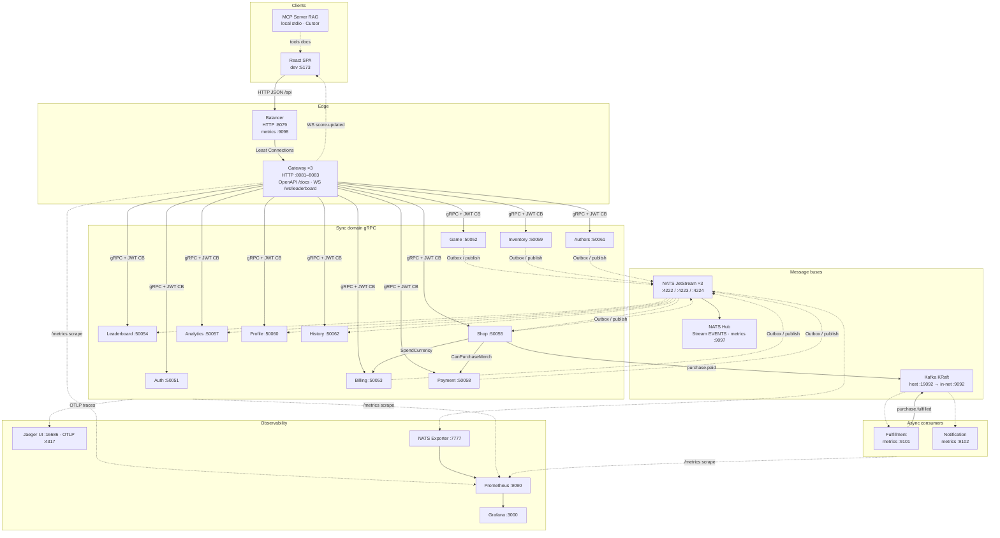
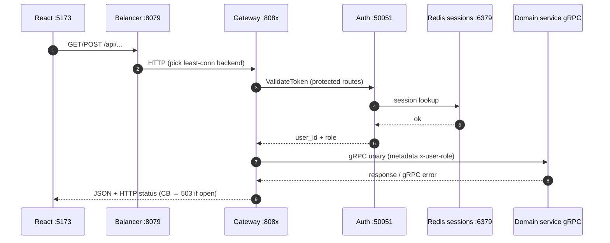
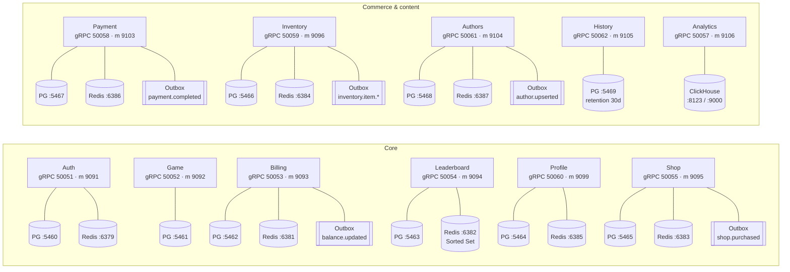
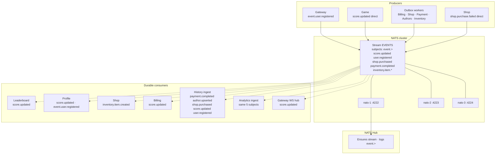
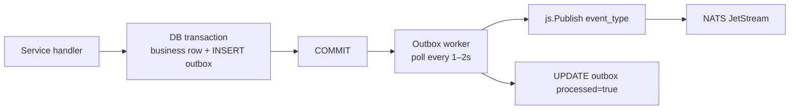
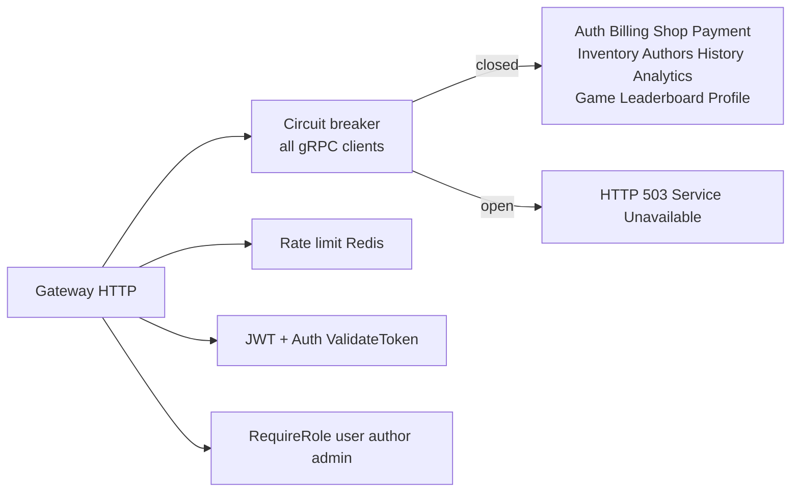
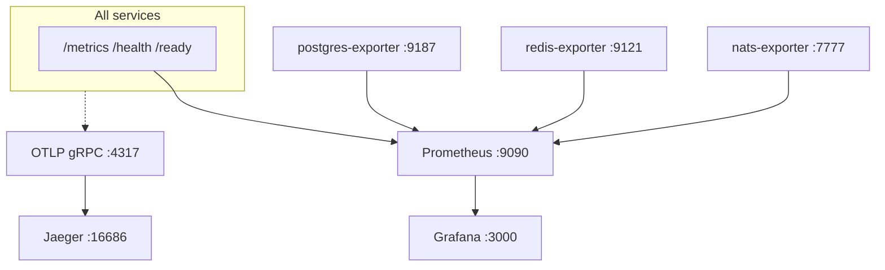

# Event Horizon — System Design (v1.0.7)

> Text + Mermaid successor to Miro [`event-horizon-v1.0.6.png`](./event-horizon-v1.0.6.png).  
> Canonical ports: `deployments/docker-compose.cluster.yml`, `confluence/architecture/EH_SCHEMAS.md`.  
> **Legend:** solid arrows = sync (HTTP/gRPC) · dashed arrows = async (NATS/Kafka/Outbox/WS)

---

## 1. Context — who talks to whom



---

## 2. Entry path (request lifecycle)



Gateway extras: `GET /openapi.yaml`, `GET /docs`, `WS /ws/leaderboard` (NATS `score.updated` fan-out).

---

## 3. Services, stores, outboxes (full port map)



| Service | gRPC | Metrics | PostgreSQL | Redis | Outbox subjects |
|---------|------|---------|------------|-------|-----------------|
| Auth | 50051 | 9091 | 5460 | 6379 | — |
| Game | 50052 | 9092 | 5461 | — | — (direct NATS) |
| Billing | 50053 | 9093 | 5462 | 6381 | `balance.updated` |
| Leaderboard | 50054 | 9094 | 5463 | 6382 | — |
| Shop | 50055 | 9095 | 5465 | 6383 | `shop.purchased` |
| Analytics | 50057 | 9106 | — | — | — (NATS ingest) |
| Payment | 50058 | 9103 | 5467 | 6386 | `payment.completed` |
| Inventory | 50059 | 9096 | 5466 | 6384 | `inventory.item.created` (+ updated/deleted in stream) |
| Profile | 50060 | 9099 | 5464 | 6385 | — |
| Authors | 50061 | 9104 | 5468 | 6387 | `author.upserted` |
| History | 50062 | 9105 | 5469 | — | — (NATS ingest) |
| Gateway ×3 | HTTP 8081–8083 | per instance | — | 6379 (shared) | — |
| Balancer | HTTP 8079 | 9098 | — | — | — |
| Fulfillment | — | 9101 | — | — | — |
| Notification | — | 9102 | — | — | — |
| NATS Hub | — | 9097 | — | — | — |

> **Note:** Auth has **no** outbox in code (unlike v1.0.6 Miro). Inventory compose uses `INVENTORY_DRIVER=postgres`; Mongo driver remains in repo for legacy/experiment.

Every gRPC service exposes **`/health`** + **`/ready`** on its metrics HTTP port.

---

## 4. NATS JetStream — stream EVENTS



### Outbox pattern (reference: Inventory / Billing)



Services with outbox table + worker today: **Billing, Shop, Payment, Authors, Inventory**.

---

## 5. Kafka purchase path (Week 5 / Order + Assembly)

```mermaid
sequenceDiagram
  autonumber
  participant U as User
  participant GW as Gateway
  participant SH as Shop
  participant BI as Billing
  participant PG as Shop PG + outbox
  participant OW as Shop outbox worker
  participant NATS as NATS
  participant K as Kafka :9092
  participant F as Fulfillment
  participant N as Notification

  U->>GW: POST /api/shop/purchase
  GW->>SH: PurchaseItem gRPC
  SH->>BI: SpendCurrency gRPC
  BI-->>SH: ok
  SH->>PG: TX stock↓ inventory purchases outbox shop.purchased
  PG-->>SH: commit
  SH->>K: purchase.paid post-commit
  OW->>PG: poll outbox
  OW->>NATS: shop.purchased
  NATS-.->History & Analytics ingest

  K->>F: purchase.paid
  F->>F: assemble delay ~10s
  F->>K: purchase.fulfilled
  K->>N: notify Telegram optional

  Note over SH,NATS: shop.purchase.failed = direct NATS on refund failure
```

| Kafka topic | Producer | Consumers |
|-------------|----------|-----------|
| `purchase.paid` | Shop (after commit) | Fulfillment, Notification |
| `purchase.fulfilled` | Fulfillment | Notification (optional Shop) |

Env: `KAFKA_BROKERS=kafka:9092` · host maps **`19092:9092`** (Game metrics owns host `:9092`).

---

## 6. Key sync business flows

```mermaid
flowchart TB
  subgraph shop_ticket["Shop purchase tickets"]
    ST1["Gateway"] --> ST2["Shop gRPC"]
    ST2 --> ST3["Billing SpendCurrency"]
    ST2 --> ST4["Shop PG TX + outbox"]
    ST4 --> ST5["Kafka purchase.paid"]
  end

  subgraph shop_merch["Shop merch gate"]
    SM1["Gateway"] --> SM2["Shop gRPC"]
    SM2 --> SM3["Payment CanPurchaseMerch"]
    SM3 --> SM4["fulfill if subscribed"]
  end

  subgraph game_lb["Game → leaderboard real-time"]
    GL1["Game SaveScore"] --> GL2["NATS score.updated"]
    GL2 --> GL3["Leaderboard PG + Redis ZSET"]
    GL2 --> GL4["Gateway WS broadcast"]
    GL4 --> GL5["React client"]
  end

  subgraph inv_shop["Inventory → shop catalog"]
    IS1["Inventory CreateItem + outbox"] --> IS2["NATS inventory.item.created"]
    IS2 --> IS3["Shop creates shop.items row"]
  end
```



---

## 7. Gateway resilience



---

## 8. Observability stack



---

## 9. Frontend surface (v1.0.7)

| Route / area | Backend |
|--------------|---------|
| Auth, games, billing, shop, inventory, leaderboard, profile | Gateway REST → gRPC |
| `/history` | `GET /api/history` → History :50062 |
| Authors, analytics admin, payment checkout UI | API clients exist · partial UI |
| Hanoi `/game/hanoi` | Game service |

---

## 10. Miro legend mapping (for board updates)

| Miro shape | v1.0.7 element |
|------------|----------------|
| Hexagon client | React :5173 |
| Blue LB / GW | Balancer :8079 · Gateway :8081–8083 |
| Yellow service box | gRPC microservice (table §3) |
| Cylinder PG | Per-service Postgres :546x |
| Diamond Redis | Per-service Redis :638x (Auth :6379) |
| Purple outbox | Billing · Shop · Payment · Authors · Inventory |
| Purple NATS hub | JetStream ×3 + NATS Hub stream EVENTS |
| Kafka bus | purchase.paid / purchase.fulfilled |
| Green obs block | Prometheus · Grafana · Jaeger · NATS exporter |

**Delta vs v1.0.6 PNG:** Shop outbox added (19.08) · Authors/History/Analytics/Fulfillment/Notification explicit · Kafka host port 19092 · Gateway CB on all gRPC · History FE · OpenAPI auth routes v1.0.7.

---

## Related docs

- [`../EH_SCHEMAS.md`](../EH_SCHEMAS.md) — compact ASCII schemas
- [`HOW_DOES_EH_WORK.md`](./HOW_DOES_EH_WORK.md) — interview narrative
- [`../../contracts/events/PURCHASE_KAFKA.md`](../../../contracts/events/PURCHASE_KAFKA.md) — Kafka payloads
- [`../../history/2026-08/14.08.2026/TODO_FINAL_LIST.md`](../../history/2026-08/14.08.2026/TODO_FINAL_LIST.md) — P0–P2 status
